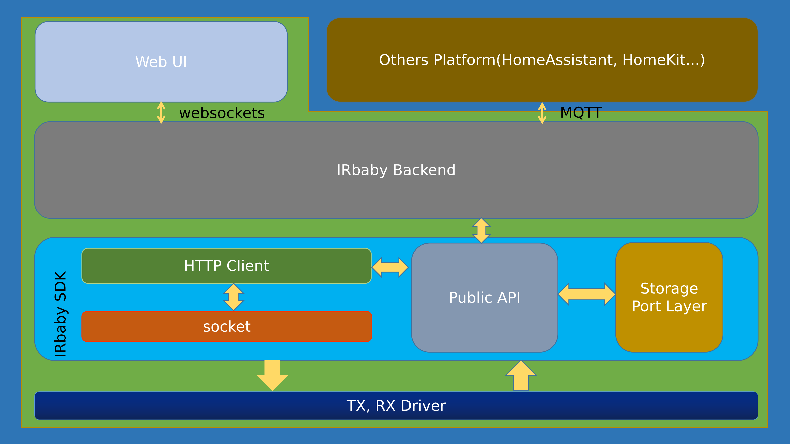

## This is IRbaby SDK

[](https://codebeat.co/projects/github-com-caffreyfans-irbaby_sdk-master)

**Your can use IRbaby quickly develop your own Infrared application. Now the IRbaby SDK support Linux and ESP32 platform.**

In test directory include some example to show how to use this SDK.

You can build test example by next step.

```bash
mkdir build && cd build

cmake ..

make

cd test
```

now you can run some example program to see how it work.

**Support API**

- [x] IRext decode
- [x] IRext login
- [x] IRext list categories
- [x] IRext list brands
- [x] IRext list indexes

## Architecture

